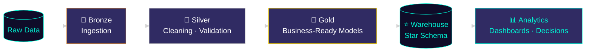

 

 

 

## `01` &nbsp;Engineering Philosophy

> Data engineering is a chain of trust, not a chain of scripts. Every stage — ingestion, cleaning, modeling, serving — either preserves that trust or breaks it. Pipelines are built idempotent and incremental by default, warehouses are modeled around business logic (not source-system structure), and reporting is treated as part of the engineering — not an afterthought.

 

## `02` &nbsp;Current Focus

<table>
<tr>
<td width="50%" valign="top">

**🎯 Building**
- Scalable cloud-native data platforms on Azure
- Distributed processing with Databricks + PySpark
- Dimensional data modeling & modern ELT
- Executive-grade BI dashboards

</td>
<td width="50%" valign="top">

**📈 Snapshot**
- `3` production-style ELT/ETL pipelines shipped
- `100K+` records processed in Azure pipeline
- `14` reporting views across a star-schema warehouse
- `National Finalist` — Smart India Hackathon

</td>
</tr>
</table>

 

## `03` &nbsp;Technical Toolbox

**Languages**
 

**Cloud & Data Engineering**
 

**Databases & Warehousing**
 

**BI, Analytics & DevOps**
 

 

## `04` &nbsp;Featured Projects

<table>
<tr>
<td width="100%">

### 🍽️ Restaurant POS ELT Pipeline & Analytics Warehouse
**Problem →** Restaurant operators reconciled sales, ops, and KPI reports manually across disconnected POS exports.
**Built →** A production-grade, metadata-driven ELT pipeline staging raw POS reports into an analytics-ready DuckDB warehouse.
**Impact →** One automated source of truth for sales performance, ops efficiency, and KPI reporting — replacing manual reconciliation entirely.
**Architecture →** Bronze → Silver → Gold staging · Star schema — 3 fact tables, 6 dimension tables, 14 reporting views · Containerized, CI-automated deployment · 3 interactive Power BI dashboards.

`Python` `SQL` `Pandas` `DuckDB` `Apache Parquet` `Power BI` `Docker` `GitHub Actions`

</td>
</tr>
<tr>
<td width="100%">

### ☁️ End-to-End E-Commerce Data Pipeline on Azure (Olist)
**Problem →** E-commerce order data lived across HTTP APIs and SQL Server with no unified, low-latency reporting layer.
**Built →** Parameterized Azure Data Factory pipelines ingesting 100K+ order records into a Databricks-processed, Synapse-served warehouse.
**Impact →** Reliable, low-latency business reporting at scale with fault-tolerant multi-source ingestion.
**Architecture →** Medallion architecture on Databricks (PySpark) · Partitioned Synapse SQL views · Fault-tolerant batch ingestion into ADLS Gen2.

`Azure Data Factory` `ADLS Gen2` `Azure Databricks` `PySpark` `Synapse Analytics` `MongoDB` `Power BI`

</td>
</tr>
<tr>
<td width="100%">

### 🛍️ Retail Sales Analytics Platform
**Problem →** Retail transaction data held revenue and segmentation insight that wasn't surfaced anywhere.
**Built →** SQL and Python-driven analysis of 2,000+ transactions feeding interactive Power BI dashboards.
**Impact →** Revenue trends, customer segments, and discount impact surfaced across 6 categories, 5 regions, 3 channels to support growth decisions.
**Architecture →** SQL-based ETL workflows · EDA & statistical analysis for analytics-ready datasets · KPI-tracking executive dashboards.

`SQL` `Python` `Pandas` `NumPy` `Matplotlib` `Seaborn` `Power BI` `MySQL` `Jupyter`

</td>
</tr>
</table>

 

## `05` &nbsp;Engineering Focus Matrix

| Area | Focus |
|---|---|
| ☁️ Cloud Data Engineering | Azure Data Factory · Azure Databricks · ADLS Gen2 |
| 🏛️ Data Warehousing | Azure Synapse Analytics · DuckDB · Star Schema Modeling |
| ⚡ Distributed Processing | PySpark · Staged Batch Pipelines |
| 🧮 Analytics Engineering | SQL Modeling · Data Quality · Incremental Processing |
| 📊 Business Intelligence | Power BI · Tableau · DAX · KPI Reporting |
| 🔁 Pipeline Automation | Docker · GitHub Actions · CI/CD |

 

## `06` &nbsp;GitHub Analytics

 

## `07` &nbsp;Certifications

- 🎓 **Big Data Engineering Bootcamp with GCP & Azure Cloud** (74 Hours) — Udemy
- 🎓 **Ultimate Job-Ready AI-Powered Data Analytics Course** — CodeWithHarry

 

## Let's Build Something Data-Driven

Open to conversations on data engineering, analytics platforms, and cloud architecture.

  

 

