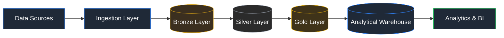

# Atharva Rahul Korwar

### Data Engineer&nbsp;|&nbsp;Data & Analytics Engineer

**Building scalable cloud-native data platforms that transform raw data into reliable business insights.**

 

 

 

## About Me

I design and build reliable, production-grade data platforms — from raw ingestion to analytics-ready gold layers. My work spans batch and streaming ELT pipelines, cloud-native data warehousing, and business intelligence layers that turn operational data into decisions.

I focus on:

- Architecting Medallion-style (Bronze → Silver → Gold) data pipelines with strong data quality guarantees
- Designing cloud data platforms on Azure, from ingestion through Synapse and Databricks
- Building distributed batch and streaming systems with Spark, Kafka, and Airflow
- Translating warehouse-grade data into executive-ready BI dashboards

 

## Core Competencies

<table>
<tr>
<td valign="top" width="50%">

**Languages**

&nbsp;&nbsp;

**Cloud & Platform**

**Data Engineering**

&nbsp;&nbsp;

</td>
<td valign="top" width="50%">

**Databases**

&nbsp;&nbsp;

**Analytics & BI**

**DevOps**

</td>
</tr>
</table>

 

## Featured Projects

<table>
<tr>
<td width="50%" valign="top">

### 🍽️ [Restaurant POS ELT Platform](https://github.com/Atharva-512/restaurant-pos-elt-pipeline)

End-to-end ELT platform implementing Medallion Architecture (Bronze → Silver → Gold), a DuckDB analytical warehouse with star-schema modeling, and interactive Power BI dashboards for restaurant operations.

</td>
<td width="50%" valign="top">

### ☁️ [Azure E-Commerce Data Pipeline](https://github.com/Atharva-512/azure-ecommerce-data-pipeline)

Cloud-native batch pipeline on Azure Data Factory, Databricks, ADLS Gen2, and Synapse Analytics, engineered for scalable ingestion and transformation.

</td>
</tr>
<tr>
<td width="50%" valign="top">

### ⚡ [Real-Time Financial Transaction Monitoring](https://github.com/Atharva-512/real-time-financial-monitoring)

Streaming data platform using Kafka and Spark Structured Streaming for low-latency ingestion and monitoring of financial transactions.

</td>
<td width="50%" valign="top">

### 🚚 [Retail Supply Chain Data Pipeline](https://github.com/Atharva-512/retail-supply-chain-pipeline)

Batch data pipeline for retail supply chain data using PySpark and Airflow, covering ingestion, transformation, and analytical reporting.

</td>
</tr>
</table>

 

## Engineering Focus

| Area | Focus |
|---|---|
| ✅ Cloud Data Engineering | Azure Data Factory, Databricks, Synapse Analytics |
| ✅ Batch Processing | PySpark pipelines with schema-aware transformations |
| ✅ Streaming Pipelines | Kafka + Spark Structured Streaming |
| ✅ ELT Architecture | Medallion (Bronze → Silver → Gold) design |
| ✅ Data Warehousing | Star-schema modeling, DuckDB, Synapse |
| ✅ Distributed Computing | Apache Spark, Airflow orchestration |
| ✅ Business Intelligence | Power BI, Tableau executive dashboards |

 

## Architecture

 

## GitHub Statistics

> **Note:** stat widgets above are rendered live by third-party services (github-readme-stats / streak-stats) and can occasionally show a broken image on first load due to free-tier rate limits. A hard refresh (or waiting ~30 seconds) usually resolves it once the badges are cached on GitHub's side.

 

## Current Focus

- Cloud data platforms on Azure
- Distributed processing with Apache Spark
- Modern data warehousing patterns
- Analytics engineering & BI delivery
- Production-grade, observable data pipelines

 

## Let's Connect

 

*"Building scalable data platforms that transform raw data into reliable business insights."*

